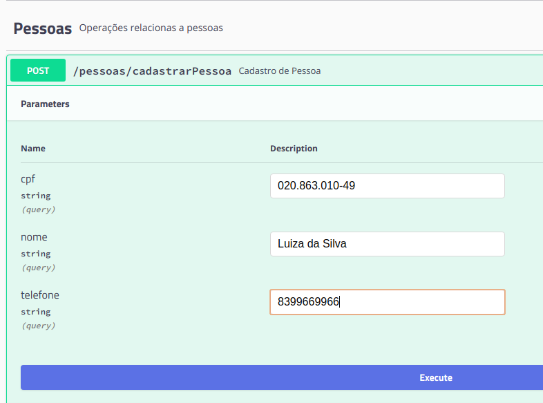
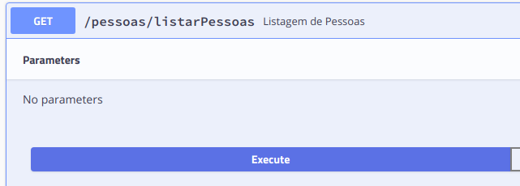
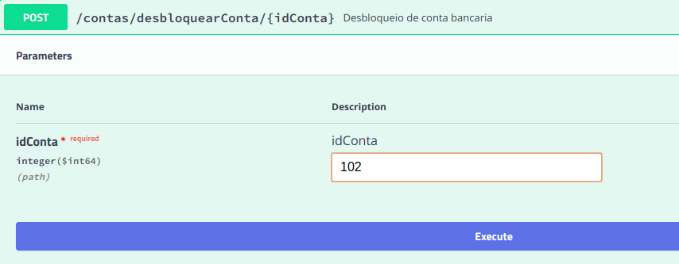
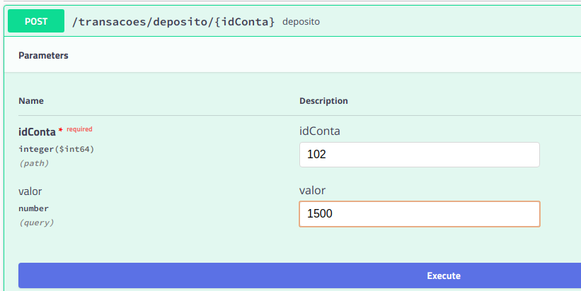
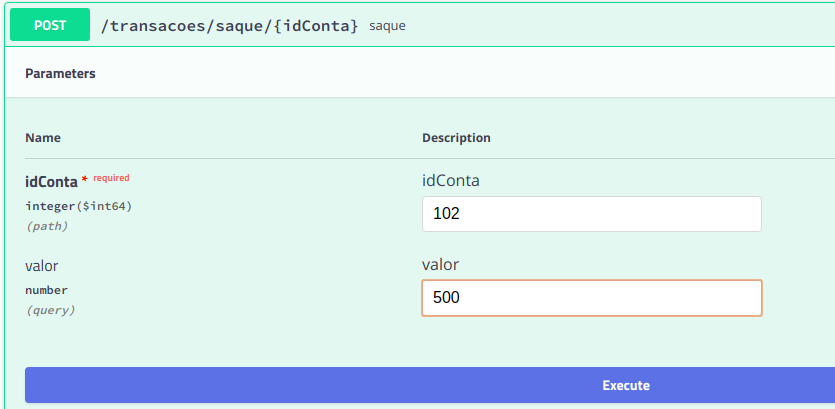
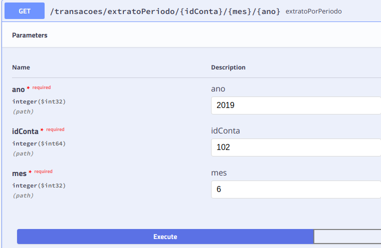

# Sobre a Aplicação

O objetivo desta aplicação é simular operações bancárias.

## Operações do sistema:

A seguir estão os endpoints disponíveis na API Swagger da aplicação.

* Cadastrar Pessoas



* Listar Pessoas



* Criar Conta


* Bloquear Conta


* Desbloquear Conta



* Listar Contas 


* Consultar Saldo


* Depósito



* Saque



* Extrato de Conta


* Extrato de Conta por Período



## Instalando o Docker-CE

* Instale o Docker-CE seguindo as instruções das páginas abaixo de acordo com a
distribuição GNU/Linux.

No Ubuntu: https://docs.docker.com/install/linux/docker-ce/ubuntu

No CentOS: https://docs.docker.com/install/linux/docker-ce/centos

No Debian: https://docs.docker.com/install/linux/docker-ce/debian

* Altere o valor da variárel ``USUARIO`` pelo nome da sua conta no S.O no qual
o Docker foi instalado e execute os comandos abaixo para adicionar o seu usuário
 ao grupo Docker.

```bash
USUARIO="seu-nome-usuario"
sudo usermod -aG docker $USUARIO
sudo setfacl -m user:$USUARIO:rw /var/run/docker.sock
```

## Executando a aplicação usando o Docker

Use o comando a seguir para iniciar um conteiner da aplicação e removê-lo automaticamente após a execução dos testes.

```sh
docker run --rm -i -t --name challenge jmilitao/challenge:latest /bin/bash
```