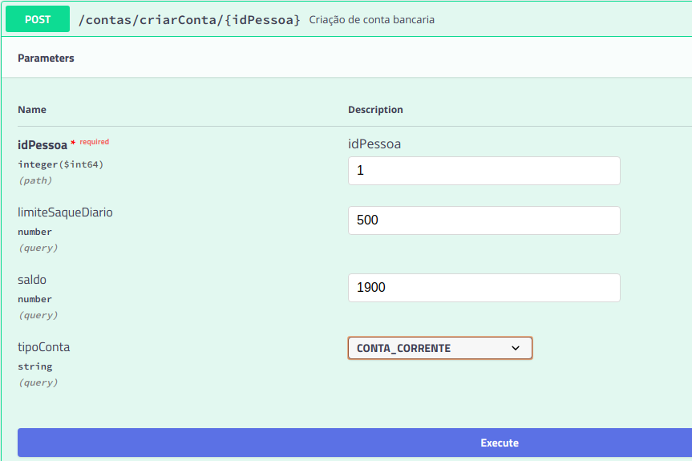
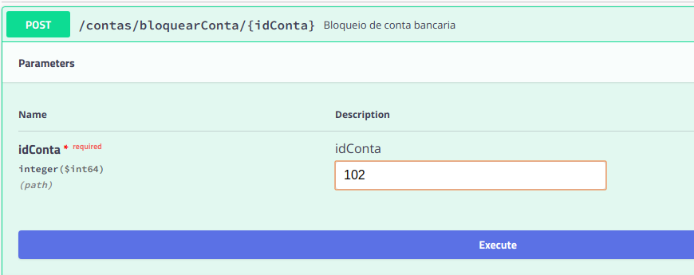
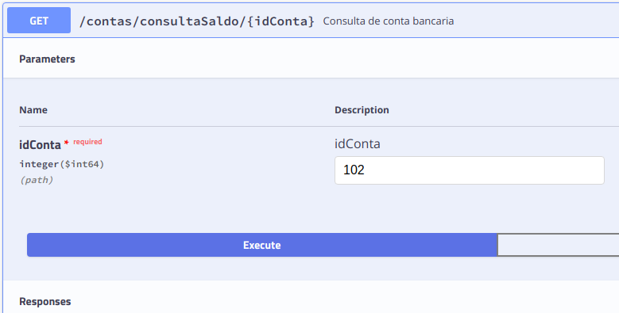
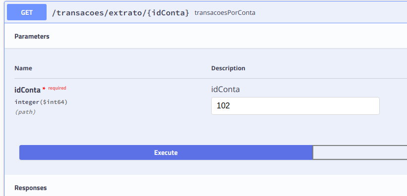

[Sobre a Aplicação]: #sobre-a-aplicação
[Operações do Sistema]: #operacoes-do-sistema
[Instalando o Docker-CE]: #instalando-o-docker-ce
[Iniciando o conteiner da aplicação]: #inciando-o-conteiner-da-aplicação
[Referências do Docker]: #referências-do-docker

#### Conteúdo
1. [Sobre a Aplicação][Sobre a Aplicação]
    - [Operações do Sistema][Operações do Sistema]
2. [Instalando o Docker-CE][Instalando o Docker-CE]
3. [Iniciando o conteiner da aplicação][Iniciando o conteiner da aplicação]
4. [Referências do Docker][Referências do Docker]

# Sobre a Aplicação

O objetivo desta aplicação é simular operações bancárias.

## Operações do sistema:

A seguir estão os endpoints disponíveis na API Swagger da aplicação.

* Cadastrar Pessoas


* Listar Pessoas


* Criar Conta



* Bloquear Conta



* Desbloquear Conta


* Listar Contas 


* Consultar Saldo



* Depósito


* Saque


* Extrato de Conta



* Extrato de Conta por Período


## Instalando o Docker-CE

* Instale o Docker-CE seguindo as instruções das páginas abaixo de acordo com a
distribuição GNU/Linux.

No Ubuntu: https://docs.docker.com/install/linux/docker-ce/ubuntu

No CentOS: https://docs.docker.com/install/linux/docker-ce/centos

No Debian: https://docs.docker.com/install/linux/docker-ce/debian

* Altere o valor da variárel ``USUARIO`` pelo nome da sua conta no S.O no qual
o Docker foi instalado e execute os comandos abaixo para adicionar o seu usuário
 ao grupo Docker.

```bash
USUARIO="seu-nome-usuario"
sudo usermod -aG docker $USUARIO
sudo setfacl -m user:$USUARIO:rw /var/run/docker.sock
```

## Iniciando o conteiner da aplicação

Use o comando a seguir para iniciar um conteiner do banco de dados.

```sh
sudo mkdir -p /docker/postgresql/sistema-bancario/data
sudo chown -R 999:999 /docker/postgresql/sistema-bancario/data

docker run -p 5433:5432 -d --name postgres \
--restart=always \
-v /docker/postgresql/sistema-bancario/data:/var/lib/postgresql/data \
-e POSTGRES_DB="sistema-bancario" \
-e POSTGRES_PASSWORD="postgres" \
-e POSTGRES_USER="postgres" \
postgres
```

Use o comando a seguir para iniciar um conteiner da aplicação.

```sh
docker run -d -p 8080:8080 --name sistema-bancario \
-e DATASOURCE_URL="postgresql://172.17.0.1:5433/sistema-bancario" \
-e DATASOURCE_USERNAME="postgres" \
-e DATASOURCE_PASSWORD="postgres" \
jmilitao/sistema-bancario:latest
```

Acesse a API da aplicação na URL http://172.17.0.1:8080/swagger-ui.html

Use os comandos a seguir visualizar o log dos conteineres.

```sh
docker logs -f postgres
docker logs -f sistema-bancario
```

## Referências do Docker

https://docs.docker.com/engine/tutorials/dockerimages/

https://www.digitalocean.com/community/tutorials/how-to-install-and-use-docker-on-ubuntu-16-04

https://docs.docker.com/engine/reference/commandline/commit/

https://www.digitalocean.com/community/tutorials/docker-explained-how-to-create-docker-containers-running-memcached